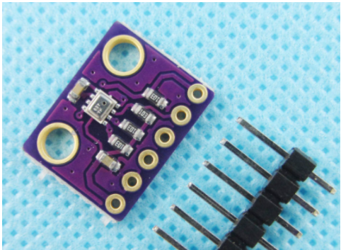
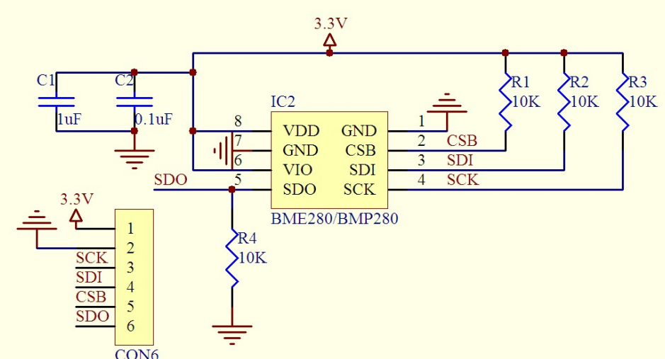

# STM32 BMP280模块 获取气压温度高度传感器数据 TFT显示
## 简介
BMP280是博世最新推出的数字气压传感器，具有卓越的性能和低廉的价格，相对精度为±0.12 hPa（相当于±1米），传感器功耗仅有2.7μA，包括压力和温度测量功能。
气压传感器支持SPI和IIC通信接口，相比上一代的BMP180，精度已有相当大的提升，非常适合应用于低成本的多旋翼飞行器飞行控制器上，价格仅有目前流行的MS5611的四分之一。


## 传感器数据获取流程
#### BMP280的测试启动流程

（1）读取BMP280的id，其值等于0x58。

（2）把补偿寄存器的值都读出来。

（3）对BMP280进行reset。

（4）对BMP280的数据采集精度，模式。。。等进行配置。

（5）给点延时，等待数据采集完毕放入寄存器中。

（6）读取寄存器中的采集数据。
### 工程
1.BMP280.C
2.BMP280.H

#### BMP280.C

```c
#include "bmp280.h"


//初始化IIC
void BMP_IIC_Init(void)
{					     
	GPIO_InitTypeDef GPIO_InitStructure;
	//RCC->APB2ENR|=1<<4;//先使能外设IO PORTC时钟 
	RCC_APB2PeriphClockCmd(	RCC_APB2Periph_GPIOC, ENABLE );	
	   
	GPIO_InitStructure.GPIO_Pin=GPIO_Pin_12|GPIO_Pin_11;
	GPIO_InitStructure.GPIO_Mode=GPIO_Mode_Out_PP ;                            //推挽输出
	GPIO_InitStructure.GPIO_Speed=GPIO_Speed_50MHz;
	GPIO_Init(GPIOC,&GPIO_InitStructure);
 
	IIC_SCL=1;
	IIC_SDA=1;

}
//产生IIC起始信号
void BMP_IIC_Start(void)
{
	SDA_OUT();                                                                 //sda线输出
	IIC_SDA=1;	  	  
	IIC_SCL=1;
	delay_us(4);
 	IIC_SDA=0;                                                                 //START:when CLK is high,DATA change form high to low 
	delay_us(4);
	IIC_SCL=0;                                                                 //钳住I2C总线，准备发送或接收数据 
}	  
//产生IIC停止信号
void BMP_IIC_Stop(void)
{
	SDA_OUT();                                                                 //sda线输出
	IIC_SCL=0;
	IIC_SDA=0;                                                                 //STOP:when CLK is high DATA change form low to high
 	delay_us(4);
	IIC_SCL=1; 
	IIC_SDA=1;                                                                 //发送I2C总线结束信号
	delay_us(4);							   	
}
//等待应答信号到来
//返回值：1，接收应答失败
//        0，接收应答成功
u8 BMP_IIC_Wait_Ack(void)
{
	u8 ucErrTime=0;
	SDA_IN();                                                                  //SDA设置为输入  
	IIC_SDA=1;delay_us(1);	   
	IIC_SCL=1;delay_us(1);	 
	while(READ_SDA)
	{
		ucErrTime++;
		if(ucErrTime>250)
		{
			BMP_IIC_Stop();
			return 1;
		}
	}
	IIC_SCL=0;                                                                 //时钟输出0 	   
	return 0;  
} 
//产生ACK应答
void BMP_IIC_Ack(void)
{
	IIC_SCL=0;
	SDA_OUT();
	IIC_SDA=0;
	delay_us(2);
	IIC_SCL=1;
	delay_us(2);
	IIC_SCL=0;
}
//不产生ACK应答		    
void BMP_IIC_NAck(void)
{
	IIC_SCL=0;
	SDA_OUT();
	IIC_SDA=1;
	delay_us(2);
	IIC_SCL=1;
	delay_us(2);
	IIC_SCL=0;
}					 				     
//IIC发送一个字节
//返回从机有无应答
//1，有应答
//0，无应答			  
void BMP_IIC_Send_Byte(u8 txd)
{                        
    u8 t;   
	SDA_OUT(); 	    
    IIC_SCL=0;                                                                 //拉低时钟开始数据传输
    for(t=0;t<8;t++)
    {              
        IIC_SDA=(txd&0x80)>>7;
        txd<<=1; 	  
		delay_us(2);                                                           //对TEA5767这三个延时都是必须的
		IIC_SCL=1;
		delay_us(2); 
		IIC_SCL=0;	
		delay_us(2);
    }	 
} 	    
//读1个字节，ack=1时，发送ACK，ack=0，发送nACK   
u8 BMP_IIC_Read_Byte(unsigned char ack)
{
	unsigned char i,receive=0;
	SDA_IN();                                                                  //SDA设置为输入
    for(i=0;i<8;i++ )
	{
        IIC_SCL=0; 
        delay_us(2);
		IIC_SCL=1;
        receive<<=1;
        if(READ_SDA)receive++;   
		delay_us(1); 
    }					 
    if (!ack)
        BMP_IIC_NAck();                                                            //发送nACK
    else
        BMP_IIC_Ack();                                                             //发送ACK   
    return receive;
}

//从指定地址读出一个数据
//ReadAddr:开始读数的地址  
//返回值  :读到的数据
u8 BMP_iicDevReadByte(u8 devaddr,u8 addr)
{				  
	u8 temp=0;		  	    																 
	BMP_IIC_Start();  
	BMP_IIC_Send_Byte(devaddr);                                                    //发送器件写命令 	   
	BMP_IIC_Wait_Ack(); 
	BMP_IIC_Send_Byte(addr);                                                       //发送低地址
	BMP_IIC_Wait_Ack();	

	BMP_IIC_Start();  	 	   
	BMP_IIC_Send_Byte(devaddr|1);                                                  //发送器件读命令			   
	BMP_IIC_Wait_Ack();	 
	temp=BMP_IIC_Read_Byte(0);			   
	BMP_IIC_Stop();                                                                //产生一个停止条件	    
	return temp;
}

//连续读多个字节
//addr:起始地址
//rbuf:读数据缓存
//len:数据长度
void BMP_iicDevRead(u8 devaddr,u8 addr,u8 len,u8 *rbuf)
{
	int i=0;
	BMP_IIC_Start();  
	BMP_IIC_Send_Byte(devaddr);  
	BMP_IIC_Wait_Ack();	
	BMP_IIC_Send_Byte(addr);                                                       //地址自增  
	BMP_IIC_Wait_Ack();	

	BMP_IIC_Start();  	
	BMP_IIC_Send_Byte(devaddr|1);  	
	BMP_IIC_Wait_Ack();	
	for(i=0; i<len; i++)
	{
		if(i==len-1)
		{
			rbuf[i]=BMP_IIC_Read_Byte(0);                                          //最后一个字节不应答
		}
		else
			rbuf[i]=BMP_IIC_Read_Byte(1);
	}
	BMP_IIC_Stop( );	
}

//从指定地址写入一个数据
//WriteAddr :写入数据的目的地址    
//DataToWrite:要写入的数据
void BMP_iicDevWriteByte(u8 devaddr,u8 addr,u8 data)
{				   	  	    																 
	BMP_IIC_Start();  
	BMP_IIC_Send_Byte(devaddr);                                                    //发送器件写命令 	 
	BMP_IIC_Wait_Ack();	   
	BMP_IIC_Send_Byte(addr);                                                       //发送低地址
	BMP_IIC_Wait_Ack(); 	 										  		   
	BMP_IIC_Send_Byte(data);                                                       //发送字节							   
	BMP_IIC_Wait_Ack();  		    	   
	BMP_IIC_Stop();		                                                           //产生一个停止条件 	 
}

//连续写多个字节
//addr:起始地址
//wbuf:写数据缓存
//len:数据的长度
void BMP_iicDevWrite(u8 devaddr,u8 addr,u8 len,u8 *wbuf)
{
	int i=0;
	BMP_IIC_Start();  
	BMP_IIC_Send_Byte(devaddr);  	
	BMP_IIC_Wait_Ack();	
	BMP_IIC_Send_Byte(addr);  //地址自增
	BMP_IIC_Wait_Ack();	
	for(i=0; i<len; i++)
	{
		BMP_IIC_Send_Byte(wbuf[i]);  
		BMP_IIC_Wait_Ack();		
	}
	BMP_IIC_Stop( );	
}


/*bmp280 气压和温度过采样 工作模式*/
#define BMP280_PRESSURE_OSR			(BMP280_OVERSAMP_8X)
#define BMP280_TEMPERATURE_OSR		(BMP280_OVERSAMP_16X)
#define BMP280_MODE					(BMP280_PRESSURE_OSR<<2|BMP280_TEMPERATURE_OSR<<5|BMP280_NORMAL_MODE)


typedef struct 
{
    u16 dig_T1;                                             /* calibration T1 data */
    s16 dig_T2;                                             /* calibration T2 data */
    s16 dig_T3;                                             /* calibration T3 data */
    u16 dig_P1;                                             /* calibration P1 data */
    s16 dig_P2;                                             /* calibration P2 data */
    s16 dig_P3;                                             /* calibration P3 data */
    s16 dig_P4;                                             /* calibration P4 data */
    s16 dig_P5;                                             /* calibration P5 data */
    s16 dig_P6;                                             /* calibration P6 data */
    s16 dig_P7;                                             /* calibration P7 data */
    s16 dig_P8;                                             /* calibration P8 data */
    s16 dig_P9;                                             /* calibration P9 data */
    s32 t_fine;                                             /* calibration t_fine data */
} bmp280Calib;

bmp280Calib  bmp280Cal;

static u8 bmp280ID=0;
static bool isInit=false;
static s32 bmp280RawPressure=0;
static s32 bmp280RawTemperature=0;

static void bmp280GetPressure(void);
static void presssureFilter(float* in,float* out);
static float bmp280PressureToAltitude(float* pressure/*, float* groundPressure, float* groundTemp*/);

bool bmp280Init(void)
{	
    if (isInit)
        return true;

	BMP_IIC_Init();		                                                           /*初始化I2C*/
    delay_ms(20);
	
	bmp280ID=BMP_iicDevReadByte(BMP280_ADDR,BMP280_CHIP_ID);	                   /* 读取bmp280 ID*/
	
	if(bmp280ID==BMP280_DEFAULT_CHIP_ID)
		printf("BMP280 ID IS: 0x%X\n",bmp280ID);
    else
        return false;

    /* 读取校准数据 */
    BMP_iicDevRead(BMP280_ADDR,BMP280_TEMPERATURE_CALIB_DIG_T1_LSB_REG,24,(u8 *)&bmp280Cal);	
	BMP_iicDevWriteByte(BMP280_ADDR,BMP280_CTRL_MEAS_REG,BMP280_MODE);
	BMP_iicDevWriteByte(BMP280_ADDR,BMP280_CONFIG_REG,5<<2);		               /*配置IIR滤波*/
	
//	printf("BMP280 Calibrate Registor Are: \r\n");
//	for(i=0;i<24;i++)
//		printf("Registor %2d: 0x%X\n",i,p[i]);
	
    isInit=true;
    return true;
}

static void bmp280GetPressure(void)
{
    u8 data[BMP280_DATA_FRAME_SIZE];

    // read data from sensor
    BMP_iicDevRead(BMP280_ADDR,BMP280_PRESSURE_MSB_REG,BMP280_DATA_FRAME_SIZE,data);
    bmp280RawPressure=(s32)((((uint32_t)(data[0]))<<12)|(((uint32_t)(data[1]))<<4)|((uint32_t)data[2]>>4));
    bmp280RawTemperature=(s32)((((uint32_t)(data[3]))<<12)|(((uint32_t)(data[4]))<<4)|((uint32_t)data[5]>>4));
}

// Returns temperature in DegC, resolution is 0.01 DegC. Output value of "5123" equals 51.23 DegC
// t_fine carries fine temperature as global value
static s32 bmp280CompensateT(s32 adcT)
{
    s32 var1,var2,T;

    var1=((((adcT>>3)-((s32)bmp280Cal.dig_T1<<1)))*((s32)bmp280Cal.dig_T2))>>11;
    var2=(((((adcT>>4)-((s32)bmp280Cal.dig_T1))*((adcT>>4)-((s32)bmp280Cal.dig_T1)))>>12)*((s32)bmp280Cal.dig_T3))>>14;
    bmp280Cal.t_fine=var1+var2;
	
    T=(bmp280Cal.t_fine*5+128)>>8;

    return T;
}

// Returns pressure in Pa as unsigned 32 bit integer in Q24.8 format (24 integer bits and 8 fractional bits).
// Output value of "24674867" represents 24674867/256 = 96386.2 Pa = 963.862 hPa
static uint32_t bmp280CompensateP(s32 adcP)
{
    int64_t var1,var2,p;
    var1=((int64_t)bmp280Cal.t_fine)-128000;
    var2=var1*var1*(int64_t)bmp280Cal.dig_P6;
    var2=var2+((var1*(int64_t)bmp280Cal.dig_P5)<<17);
    var2=var2+(((int64_t)bmp280Cal.dig_P4)<<35);
    var1=((var1*var1*(int64_t)bmp280Cal.dig_P3)>>8)+((var1*(int64_t)bmp280Cal.dig_P2)<<12);
    var1=(((((int64_t)1)<<47)+var1))*((int64_t)bmp280Cal.dig_P1)>>33;
    if (var1==0)
        return 0;
    p=1048576-adcP;
    p=(((p<<31)-var2)*3125)/var1;
    var1=(((int64_t)bmp280Cal.dig_P9)*(p>>13)*(p>>13))>>25;
    var2=(((int64_t)bmp280Cal.dig_P8)*p)>>19;
    p=((p+var1+var2)>>8)+(((int64_t)bmp280Cal.dig_P7)<<4);
    return(uint32_t)p;
}

#define FILTER_NUM	5
#define FILTER_A	0.1f

/*限幅平均滤波法*/
static void presssureFilter(float* in,float* out)
{	
	static u8 i=0;
	static float filter_buf[FILTER_NUM]={0.0};
	double filter_sum=0.0;
	u8 cnt=0;	
	float deta;

	if(filter_buf[i]==0.0f)
	{
		filter_buf[i]=*in;
		*out=*in;
		if(++i>=FILTER_NUM)	
			i=0;
	} 
	else 
	{
		if(i)
			deta=*in-filter_buf[i-1];
		else 
			deta=*in-filter_buf[FILTER_NUM-1];
		
		if(fabs(deta)<FILTER_A)
		{
			filter_buf[i]=*in;
			if(++i>=FILTER_NUM)	
				i=0;
		}
		for(cnt=0;cnt<FILTER_NUM;cnt++)
		{
			filter_sum+=filter_buf[cnt];
		}
		*out=filter_sum /FILTER_NUM;
	}
}

void bmp280GetData(float* pressure,float* temperature,float* asl)
{
    static float t;
    static float p;
	
	bmp280GetPressure();

	t=bmp280CompensateT(bmp280RawTemperature)/100.0;		
	p=bmp280CompensateP(bmp280RawPressure)/25600.0;		

	presssureFilter(&p,pressure);
	*temperature=(float)t;                                                     /*单位度*/
//	*pressure=(float)p ;	                                                   /*单位hPa*/	
	
	*asl=bmp280PressureToAltitude(pressure);	                               /*转换成海拔*/	
}

#define CONST_PF 0.1902630958	                                               //(1/5.25588f) Pressure factor
#define FIX_TEMP 25				                                               // Fixed Temperature. ASL is a function of pressure and temperature, but as the temperature changes so much (blow a little towards the flie and watch it drop 5 degrees) it corrupts the ASL estimates.
								                                               // TLDR: Adjusting for temp changes does more harm than good.
/*
 * Converts pressure to altitude above sea level (ASL) in meters
*/
static float bmp280PressureToAltitude(float* pressure/*, float* groundPressure, float* groundTemp*/)
{
    if (*pressure>0)
    {
        return((pow((1015.7f/ *pressure),CONST_PF)-1.0f)*(FIX_TEMP+273.15f))/0.0065f;
    }
    else
    {
        return 0;
    }
}

```
#### BMP280.H

```c
#ifndef __BMP280_H
#define __BMP280_H


#include "sys.h"
#include "stdbool.h"
#include <math.h>
#include "delay.h"
#include "usart.h"

#define BMP280_ADDR						(0xEC)
#define BMP280_DEFAULT_CHIP_ID			(0x58)

#define BMP280_CHIP_ID					(0xD0)         /* Chip ID Register */
#define BMP280_RST_REG					(0xE0)         /* Softreset Register */
#define BMP280_STAT_REG					(0xF3)         /* Status Register */
#define BMP280_CTRL_MEAS_REG			(0xF4)         /* Ctrl Measure Register */
#define BMP280_CONFIG_REG				(0xF5)         /* Configuration Register */
#define BMP280_PRESSURE_MSB_REG			(0xF7)         /* Pressure MSB Register */
#define BMP280_PRESSURE_LSB_REG			(0xF8)         /* Pressure LSB Register */
#define BMP280_PRESSURE_XLSB_REG		(0xF9)         /* Pressure XLSB Register */
#define BMP280_TEMPERATURE_MSB_REG		(0xFA)         /* Temperature MSB Reg */
#define BMP280_TEMPERATURE_LSB_REG		(0xFB)         /* Temperature LSB Reg */
#define BMP280_TEMPERATURE_XLSB_REG		(0xFC)         /* Temperature XLSB Reg */

#define BMP280_SLEEP_MODE				(0x00)
#define BMP280_FORCED_MODE				(0x01)
#define BMP280_NORMAL_MODE				(0x03)

#define BMP280_TEMPERATURE_CALIB_DIG_T1_LSB_REG             (0x88)
#define BMP280_PRESSURE_TEMPERATURE_CALIB_DATA_LENGTH       (24)
#define BMP280_DATA_FRAME_SIZE			(6)

#define BMP280_OVERSAMP_SKIPPED			(0x00)
#define BMP280_OVERSAMP_1X				(0x01)
#define BMP280_OVERSAMP_2X				(0x02)
#define BMP280_OVERSAMP_4X				(0x03)
#define BMP280_OVERSAMP_8X				(0x04)
#define BMP280_OVERSAMP_16X				(0x05)


bool bmp280Init(void);
void bmp280GetData(float* pressure, float* temperature, float* asl);


//IO方向设置
#define SDA_IN()  {GPIOC->CRH&=0XFFFF0FFF;GPIOC->CRH|=8<<12;}
#define SDA_OUT() {GPIOC->CRH&=0XFFFF0FFF;GPIOC->CRH|=3<<12;}

//IO操作函数	 
#define IIC_SCL    PCout(12)                                                   //SCL
#define IIC_SDA    PCout(11)                                                   //SDA	 
#define READ_SDA   PCin(11)                                                    //输入SDA 

//IIC所有操作函数
void BMP_IIC_Init(void);                                                           //初始化IIC的IO口				 
void BMP_IIC_Start(void);				                                           //发送IIC开始信号
void BMP_IIC_Stop(void);	  			                                           //发送IIC停止信号
void BMP_IIC_Send_Byte(u8 txd);			                                           //IIC发送一个字节
u8   BMP_IIC_Read_Byte(unsigned char ack);                                           //IIC读取一个字节
u8   BMP_IIC_Wait_Ack(void); 				                                           //IIC等待ACK信号
void BMP_IIC_Ack(void);					                                           //IIC发送ACK信号
void BMP_IIC_NAck(void);				                                           //IIC不发送ACK信号

void BMP_IIC_Write_One_Byte(u8 daddr,u8 addr,u8 data);
u8   BMP_IIC_Read_One_Byte(u8 daddr,u8 addr);	
			 
u8   BMP_iicDevReadByte(u8 devaddr,u8 addr);	                                       /*读一字节*/
void BMP_iicDevWriteByte(u8 devaddr,u8 addr,u8 data);	                           /*写一字节*/
void BMP_iicDevRead(u8 devaddr,u8 addr,u8 len,u8 *rbuf);                           /*连续读取多个字节*/
void BMP_iicDevWrite(u8 devaddr,u8 addr,u8 len,u8 *wbuf);                          /*连续写入多个字节*/

#endif
```
#### MAIN.C

```c
/**
  ************************************* Copyright ****************************** 
  *    
  * FileName   : main.c   
  * Version    : v1.0		
  * Author     : dele			
  * Date       : 2022-01-06         
  ******************************************************************************
 */
//--------------------------------------------------------------------------------------------------
//  包含的系统外设头文件    |   0   |   1   |   2   |   3   |   4   |   5   |   6   |   7   |   8   |   9   
//--------------------------------------------------------------------------------------------------
#include "sys.h"
#include "delay.h"
#include "USART.H"

#include "timer.h"
#include "adc.h"
#include <math.h>
#include "wdg.h" 
//--------------------------------------------------------------------------------------------------
//  包含的外部驱动头文件    |   0   |   1   |   2   |   3   |   4   |   5   |   6   |   7   |   8   |   9   
//--------------------------------------------------------------------------------------------------
#include "led.h"
#include "LCD.H"
#include "QDTFT_demo.h"
#include "Picture.h"
#include "key.h"
#include "oled.h"
#include "beep.h"
#include "dht11.h"
#include "bh1750.h"
#include "syn6288.h"
#include "AHT10.H"
#include "bmp280.h"
//--------------------------------------------------------------------------------------------------
//  网络协议驱动头文件    |   0   |   1   |   2   |   3   |   4   |   5   |   6   |   7   |   8   |   9   
//--------------------------------------------------------------------------------------------------
#include "gizwits_product.h" //机智云网络协议驱动
//--------------------------------------------------------------------------------------------------
//  宏自定义声明    |   0   |   1   |   2   |   3   |   4   |   5   |   6   |   7   |   8   |   9   
//--------------------------------------------------------------------------------------------------

//--------------------------------------------------------------------------------------------------
//  定义引用变量    |   0   |   1   |   2   |   3   |   4   |   5   |   6   |   7   |   8   |   9   
//--------------------------------------------------------------------------------------------------
//unsigned char num;
/* u8 unsigned char u16 unsigned short  u32 unsigned int  u64 unsigned long*/

unsigned short MQ135_ADC,MQ2_ADC,MQ4_ADC,MQ7_ADC;                                      //ADC采集值
float temp1,temp2,temp3,temp4,MQ135_quality,MQ2_quality,MQ4_quality,MQ7_quality,Light; //实际转换值
extern u8 DHT11_Temp,DHT11_Hum;		                                                   //温湿度    
float aht_temp,aht_hum;

unsigned int time1 =0;
unsigned int timeCount1=0;
unsigned int timeflag1 =0; 

unsigned int time2 =0;
unsigned int timeCount2=0;
unsigned int timeflag2 =0; 

unsigned int time3 =0;
unsigned int timeCount3=0;
unsigned int timeflag3 =0; 

unsigned int time4 =0;
unsigned int timeCount4=0;
unsigned int timeflag4 =0;

unsigned int Basictime =0;
unsigned int BasictimeCount=0;
unsigned int Basictimeflag =0; 

unsigned char IC_Card[4]={0};
//--------------------------------------------------------------------------------------------------
//  硬件端口定义    |   0   |   1   |   2   |   3   |   4   |   5   |   6   |   7   |   8   |   9   
//--------------------------------------------------------------------------------------------------

//--------------------------------------------------------------------------------------------------
//  引用函数声明    |   0   |   1   |   2   |   3   |   4   |   5   |   6   |   7   |   8   |   9   
//--------------------------------------------------------------------------------------------------

void LED_TEST(void);
void Hareware_Iint(void);
void TFT_ShowTEST(void);
void Usart_Test(void);
void oled_test(void);
void Timer_Configure(void);
void GeneralTimer_Test(void);
void Basic_Timer_Test(void);
void Basic_GeneralTimer_Test(void);
void USart_Configure(void);
void DHT11_DisPlay(void);     //温湿度显示函数
void Gas_sensorGet_Data(void);//获取传感器数据
void IWdg_Test(void);
void LED_PWM_Test(void);
void BH1750_Test(void);
void Gizwits_Init(void);
void RFID_Test(void);
void PWM_Test(void);


//==================================================================================================
//  实现功能: 硬件初始化配置
//  函数说明: Hareware_Iint
//  函数备注: 
//--------------------------------------------------------------------------------------------------
//  |   -   |   -   |   0   |   1   |   2   |   3   |   4   |   5   |   6   |   7   |   8   |   9   
//==================================================================================================
void Hareware_Iint(void)
{
    delay_init();	                                // 延迟函数配置
    NVIC_PriorityGroupConfig(NVIC_PriorityGroup_2); //设置中断优先级分组为组2：2位抢占优先级，2位响应优先级
//  Timer_Configure();//定时器配置
    USART1_Configuration(115200);                   //串口1配置
    LED_Init();                         	        //板载LED配置
    KEY_Init();                                     //板载独立按键测试
	DHT11_Init();                                   //DHT11温湿度传感器
	AHT_I2C_UserConfig();
    OLED_Init();                                    // IIC 0.96 oled
    Lcd_Init();                                     //ST7735 LCD配置
    LCD_LED_SET;                                    //设置背光
    Lcd_Clear(WHITE);                               //清屏 
    BEEP_Init();                                    //蜂鸣器配置
    BH1750_Init();                                  //光照传感器配置
    Adc_Init();                                     //ADC配置
    BMP_IIC_Init(); 
	bmp280Init();

    Gizwits_Init();                                //机智云配置

    
    #if 0
    /*独立看门狗配置*/
    IWDG_Init(4,625);    //与分频数为64,重载值为625,溢出时间为1s	
    /*窗口看门狗配置*/
    WWDG_Init(0X7F,0X5F,WWDG_Prescaler_8);//计数器值为7f,窗口寄存器为5f,分频数为8	   
    #endif 
//  TIM3_PWM_Init(899,0);	 //不分频。PWM频率=72000000/900=80Khz     
}
//==================================================================================================
//  实现功能: LED测试函数
//  函数说明: PB5 LED0  PE5 LED1
//  函数备注: 板载LED 正常 
//--------------------------------------------------------------------------------------------------
//  |   -   |   -   |   0   |   1   |   2   |   3   |   4   |   5   |   6   |   7   |   8   |   9   
//==================================================================================================  
void LED_TEST(void)
{
      LED0=0;
      delay_ms(500);
      LED0=1;
      delay_ms(500);
      LED1=0;
      delay_ms(500);
      LED1=1;
      delay_ms(500);
}
//==================================================================================================
//  实现功能: TFT_ShowTEST测试函数
//  函数说明: 
//  函数备注: ST7735 TFTLCD 测试正常
//--------------------------------------------------------------------------------------------------
//  |   -   |   -   |   0   |   1   |   2   |   3   |   4   |   5   |   6   |   7   |   8   |   9   
//==================================================================================================  
void  TFT_ShowTEST(void)
{
      // Redraw_Mainmenu();
      Num_Test();
      // Font_Test();
      Color_Test();
      //TFT_ShowImage(gImage_qq);
    
      Lcd_Clear(WHITE); //清屏 
      TFT_ShowString_16x16(0,16,"stm32 vscode",Red,White);
      delay_ms(1000);
      TFT_ShowNumber_SignedInteger_16x16(16,32,1234,5,Red,White);
      delay_ms(1000);
      TFT_ShowNumber_Float_16x16(0,48,123.56,4,3,Red,White);
      delay_ms(1000);
      TFT_ShowString_16x16(16,60,"By 2021-01-29",Red,White);
      delay_ms(1000);
      TFT_ShowString_16x16(0,90,"keil5 vscode",Red,White);
      delay_ms(1000);
      
}
//==================================================================================================
//  实现功能: 串口配置配置
//  函数说明: TIM2,3,4,5
//  函数备注: 
//--------------------------------------------------------------------------------------------------
//  |   -   |   -   |   0   |   1   |   2   |   3   |   4   |   5   |   6   |   7   |   8   |   9   
//================================================================================================== 
void USart_Configure(void)
{
//    UART4_Configuration(9600);//串口4配置
//    USART1_Configuration(115200);//串口1配置
}
//==================================================================================================
//  实现功能: Usart_Test测试函数
//  函数说明: 串口配置测试函数  STM32F103ZET6 5个串口
//  函数备注: USART1  USART2 USART3 UART4 UART5 
//   TX端口   PA9     PA2    PB10   PC10  PC12
//   RX端口   PA10    PA3    PB11   PC11  PD2
//  串口1~5 测试正常 打印效果正常
//--------------------------------------------------------------------------------------------------
//  |   -   |   -   |   0   |   1   |   2   |   3   |   4   |   5   |   6   |   7   |   8   |   9   
//==================================================================================================  
void Usart_Test(void)
{
  
  #if 0
  UART_SendString(USART1,"usart1 test \r\n");
  delay_ms(500);
  TFT_ShowString_16x16(0,0,"usart1 test",Red,White);
  #endif
  
  #if 0
  UART_SendString(USART2,"usart2 test \r\n");
  delay_ms(500);
  TFT_ShowString_16x16(0,16,"usart2 test",Red,White);
  #endif
  
  #if 0
  UART_SendString(USART3,"usart3 test \r\n");
  delay_ms(500);
  TFT_ShowString_16x16(0,32,"usart3 test",Red,White);
  #endif
  
  #if 0
  UART_SendString(UART4,"uart4 test \r\n");
  delay_ms(500);
  TFT_ShowString_16x16(0,48,"uart4 test",Red,White);
  #endif
  
  #if 0 
  UART_SendString(UART5,"uart5 test \r\n");
  delay_ms(500);
  TFT_ShowString_16x16(0,54,"uart5 test",Red,White);
  #endif
  
  #if 1 
  UART_SendNumber_SignedInteger(USART1,123,4);
  UART_SendLine(USART1);
  delay_ms(500);
  UART_SendNumber_UnsignedInteger(USART1,123,4);
  UART_SendLine(USART1);
  delay_ms(500);
  UART_SendNumber_Float(USART1,123.56,4,3);
  UART_SendLine(USART1);
  delay_ms(500);
  UART_SendNumber_Binary(USART1,9,4);
  UART_SendLine(USART1);
  delay_ms(500);
  
  #endif
  
  
}

//==================================================================================================
//  实现功能: oled_test测试函数
//  函数说明: 采用软件IIC 进行配置   SDA PB9  SCL in 
//  函数备注:  测试正常
//--------------------------------------------------------------------------------------------------
//  |   -   |   -   |   0   |   1   |   2   |   3   |   4   |   5   |   6   |   7   |   8   |   9   
//==================================================================================================  
void oled_test(void)
{
  OLED_ShowChar_08x16(0,0,'@');
  OLED_ShowChar_08x16(16,0,'&');
  OLED_ShowNumber_SignedInteger_06x08(0,2,1234,5);
  OLED_ShowNumber_UnsignedInteger_06x08(48,2,1234,5);
  OLED_ShowNumber_Float_06x08(0,4,123.46,3,3);
  OLED_ShowString_06x08(32,0,"oled");
  OLED_ShowCHinese(0,6,0);
  OLED_ShowCHinese(16,6,1);
  OLED_ShowCHinese(32,6,2);
  OLED_ShowCHinese(48,6,3);
  OLED_ShowCHinese(64,6,4);
//  OLED_Clear();
}
//================================================================================================
//  实现功能: Key_Test 按键测试函数
//  函数说明: KEY0 PE4 KEY1 PE3 KEY_WK_UP PA0
//  函数备注: KEY0_PRES 1  KEY1_PRES 1  WKUP_PRES 3 
//----------------------------------------- -------------------------------------------------------
//  |   -   |   -   |   0   |   1   |   2   |   3   |   4   |   5   |   6   |   7   |   8   |   9   
//================================================================================================= 
void Key_Test(void)
{
      unsigned char key_value=0;
      TFT_ShowString_16x16(0,0,"KEY:",Red,White);
      key_value=KEY_Scan(0);
  
      if(key_value==3)
      {
        TFT_ShowNumber_SignedInteger_16x16(60,0,key_value,2,Red,White);
        //USART_SendString(USART1,"key_value:3 \r\n");
      }
      if(key_value==2)
      {
        TFT_ShowNumber_SignedInteger_16x16(60,0,key_value,2,Red,White);
        //USART_SendString(USART1,"key_value:2 \r\n");
      }
      if(key_value==1)
      {
        TFT_ShowNumber_SignedInteger_16x16(60,0,key_value,2,Red,White);
        //USART_SendString(USART1,"key_value:1 \r\n");
      }
}
//==================================================================================================
//  实现功能: 定时器配置 1s测试
//  函数说明: TIM2,3,4,5
//  函数备注: 
//--------------------------------------------------------------------------------------------------
//  |   -   |   -   |   0   |   1   |   2   |   3   |   4   |   5   |   6   |   7   |   8   |   9   
//==================================================================================================  
void Timer_Configure(void)
{
    /*定时器配置*/
    BASIC_TIM_Init();
    TIM5_Init(9999,7199);
//    TIM3_Int_Init(9999,7199);
    TIM2_Int_Init(9999,7199);
    TIM4_Int_Init(9999,7199);
    
}
//==================================================================================================
//  实现功能: 通用定时器定时器测试
//  函数说明: TIM2,3,4,5
//  函数备注: 
//--------------------------------------------------------------------------------------------------
//  |   -   |   -   |   0   |   1   |   2   |   3   |   4   |   5   |   6   |   7   |   8   |   9   
//==================================================================================================  
void GeneralTimer_Test(void)
{
  if ( timeflag1 == 1 )  // TIM5
    {
      timeflag1 = 0;
      timeCount1++;     
			LED1=!LED1; 
      
      if (timeCount1 == 60)
      {
        timeCount1=0;
      }
      TFT_ShowNumber_SignedInteger_16x16(90,32,timeCount1,2,Blue1,White);
    }  

    
    if ( timeflag2 == 1 )  //TIM3     
    {
      timeflag2 = 0;
      timeCount2++;    

      if (timeCount2 == 60)
      {
        timeCount2=0;
      }
      TFT_ShowNumber_SignedInteger_16x16(90,60,timeCount2,2,Blue1,White);
    } 

     if ( timeflag3 == 1 )   //TIM2  
    {
      timeflag3 = 0;
      timeCount3++;    

      if (timeCount3 == 60)
      {
        timeCount3=0;
      }
      TFT_ShowNumber_SignedInteger_16x16(90,90,timeCount3,2,Green,White);
    }  
    
    if ( timeflag4 == 1 )  //TIM4   
    {
      timeflag4 = 0;
      timeCount4++;    

      if (timeCount4 == 60)
      {
        timeCount4=0;
      }
      TFT_ShowNumber_SignedInteger_16x16(90,120,timeCount4,2,Green,White);
    }   
}
//==================================================================================================
//  实现功能: 基本定时器定时器测试
//  函数说明: TIM6,7
//  函数备注: 
//--------------------------------------------------------------------------------------------------
//  |   -   |   -   |   0   |   1   |   2   |   3   |   4   |   5   |   6   |   7   |   8   |   9   
//================================================================================================== 
void Basic_Timer_Test(void)
{
   if ( Basictime == 1000 ) /* 1000 * 1 ms = 1s 时间到 */      
    {
      Basictime = 0;
      BasictimeCount++;    

      if (BasictimeCount == 60)
      {
        BasictimeCount=0;
      }
      TFT_ShowNumber_SignedInteger_16x16(90,140,BasictimeCount,2,Black,White);
    } 
}

//==================================================================================================
//  实现功能: 定时器定时 1s 测试
//  函数说明:  
//  函数备注: 
//--------------------------------------------------------------------------------------------------
//  |   -   |   -   |   0   |   1   |   2   |   3   |   4   |   5   |   6   |   7   |   8   |   9   
//================================================================================================== 
void Basic_GeneralTimer_Test(void)
{
  GeneralTimer_Test();//通用定时器定时器测试
  Basic_Timer_Test();//基本定时器定时器测试
}

#if 0

    TFT_ShowString_16x16(0,0,"stm32 timertest",Magenta,White);
    TFT_ShowString_16x16(0,32,"timeCount1 ",Blue1,White);
    TFT_ShowString_16x16(0,60,"timeCount2 ",Red,White);
    TFT_ShowString_16x16(0,90,"timeCount3 ",Red,White);
    TFT_ShowString_16x16(0,120,"timeCount4",Red,White);
    TFT_ShowString_16x16(0,140,"Basictime",Magenta,White);

#endif
//==================================================================================================
//  实现功能: DHT11_DisPlay 显示温湿度传感器数值
//  函数说明:  
//  函数备注: 
//--------------------------------------------------------------------------------------------------
//  |   -   |   -   |   0   |   1   |   2   |   3   |   4   |   5   |   6   |   7   |   8   |   9   
//================================================================================================== 
void DHT11_DisPlay(void)
{
       //循环外 硬件初始化之后
       TFT_ShowString_16x16(0,0,"TEMP:",Magenta,White);
       TFT_ShowString_16x16(0,32,"Hum: ",Blue1,White);
       //循环内 循环获取温湿度值更新
       DHT11_Read_Data(&DHT11_Temp,&DHT11_Hum);
       TFT_ShowNumber_Float_16x16(32,0,DHT11_Temp,2,1,Red,White);
       TFT_ShowNumber_Float_16x16(32,32,DHT11_Hum,2,1,Green,White);  
}
//==================================================================================================
//  实现功能: Gas_sensorGet_Data 显示传感器数值
//  函数说明:  
//  函数备注: 
//--------------------------------------------------------------------------------------------------
//  |   -   |   -   |   0   |   1   |   2   |   3   |   4   |   5   |   6   |   7   |   8   |   9   
//================================================================================================== 
void Gas_sensorGet_Data(void)
{      
  #if 0
       unsigned short MQ135_ADC,MQ2_ADC;
       float temp1,temp2,MQ135_quality,MQ2_quality;
  
       DHT11_Read_Data(&DHT11_Temp,&DHT11_Hum); 
       TFT_ShowString_16x16(0,0,"TEMP:",Magenta,White);
       TFT_ShowString_16x16(0,16,"Hum: ",Blue1,White); 
       TFT_ShowString_16x16(0,32,"MQ-2:",Magenta,White);
       TFT_ShowString_16x16(0,48,"MQ-135:",Blue1,White);
 
       MQ135_ADC=Get_Adc_Average(ADC_Channel_11,10);  
       temp1=(float)MQ135_ADC*(3.3/4096);
		   MQ135_quality=pow((11.5428 * 35.904 * temp1 )/(25.5 - 5.1 * temp1),1.0/0.6549);
		   MQ135_ADC=temp1;
		   temp1-=MQ135_ADC;
      
       MQ2_ADC = Get_Adc_Average(ADC_Channel_13,10);
       temp2=(float)MQ2_ADC*(3.3/4096);
       MQ2_quality = pow((11.5428 * 35.904 * temp2 )/(25.5 - 5.1 * temp2),1.0/0.6549);
       MQ2_ADC=temp2;
		   temp2-=MQ2_ADC;

       TFT_ShowNumber_Float_16x16(40,0,DHT11_Temp,2,1,Red,White);
       TFT_ShowNumber_Float_16x16(40,16,DHT11_Hum,2,1,Green,White); 
       TFT_ShowNumber_Float_16x16(66,32,MQ2_quality,4,1,Magenta,White);  
       TFT_ShowNumber_Float_16x16(66,48,MQ135_quality,4,1,Magenta,White); 
       
    #endif   
      
}
//==================================================================================================
//  实现功能: 独立看门狗 窗口看门狗测试
//  函数说明: 窗口看门狗
//  函数备注: 
//--------------------------------------------------------------------------------------------------
//  |   -   |   -   |   0   |   1   |   2   |   3   |   4   |   5   |   6   |   7   |   8   |   9   
//================================================================================================== 
void IWdg_Test(void)
{
   if(KEY_Scan(0) == WKUP_PRES ) 
   {
      IWDG_Feed();//如果WK_UP按下,则喂狗 执行相关操作复位
      UART_SendString(USART1,"IWDG test \r\n");
   }  
}
//==================================================================================================
//  实现功能: 定时器 PWM 功能 测试
//  函数说明: 呼吸灯效果
//  函数备注: 
//--------------------------------------------------------------------------------------------------
//  |   -   |   -   |   0   |   1   |   2   |   3   |   4   |   5   |   6   |   7   |   8   |   9   
//================================================================================================== 
void LED_PWM_Test(void)
{
    //相关变量 Hareware_Iint() 之前定义
    unsigned short Led0PwmVal=0;
    unsigned Incordecflag=1;//是否增加 减小 flag=1 增加 flag=0 减小
  
    //相关变量 while(1)  循环内部使用
//     delay_ms(10);
      
      if(Incordecflag)
      {
        Led0PwmVal++;
      }
      else
      {
        Led0PwmVal--;
      }
      
      if(Led0PwmVal > 900)
      {
        Incordecflag=0;
      }
        
      if(Led0PwmVal == 0)
      {
          Incordecflag=1;
      }
      
      TIM_SetCompare2(TIM3,Led0PwmVal); 
}
//==================================================================================================
//  实现功能: 定时器 PWM原理
//  说明:STM32F103Z系列 TIM1,TIM8 可以实现7路PWM波输出，通用定时器可以产生4路输出
//  控制PWM寄存器
//  捕获/比较模式寄存器（TIMx_CCMR1/2）CCMR1-->CH1 CH2 CCMR2-->CH3 CH4 
//	捕获/比较使能寄存器（TIMx_CCER）
//	捕获/比较寄存器（TIMx_CCR1~4) 对应 4 个输通道 CH1--CH4
//  STM32的重映射控制是由复用重映射和调试 IO 配置寄存器（AFIO_MAPR）控制
//--------------------------------------------------------------------------------------------------
//  |   -   |   -   |   0   |   1   |   2   |   3   |   4   |   5   |   6   |   7   |   8   |   9   
//================================================================================================== 
void PWM_Test(void)
{
	
}

//==================================================================================================
//  实现功能: 机智云协议配置
//  函数说明: 进行ESP8266配网操作
//  函数备注: 
//--------------------------------------------------------------------------------------------------
//  |   -   |   -   |   0   |   1   |   2   |   3   |   4   |   5   |   6   |   7   |   8   |   9   
//================================================================================================== 
void Gizwits_Init(void)
{
	TIM3_Int_Init(9,7199);//1MS系统定时
	USART3_Configuration(9600);//WIFI初始化
	userInit();//设备状态结构体初始化
	gizwitsInit();//缓冲区初始化 
  
  
}
////==================================================================================================
////  实现功能: 主函数
////  函数说明: 
////  函数备注: 
////--------------------------------------------------------------------------------------------------
////  |   -   |   -   |   0   |   1   |   2   |   3   |   4   |   5   |   6   |   7   |   8   |   9   
////==================================================================================================  
int main(void)          
{	
   
    unsigned char key;
	
	float bmp280_temp;
	float bmp280_press;
	float high;
	unsigned short Press,Temp,High;
	
        Hareware_Iint();//硬件初始化配置
	AHT10_Write_Reset();
	
	
	
	
    while(1) 
    {
	    
		//********************* 机智云网络协议配置****************************************//
		
		userHandle();//用户采集
        gizwitsHandle((dataPoint_t *)&currentDataPoint);//协议处理
		//********************************************************************************//
		
		//*********************ESP8266 WiFi模块配网****************************************//
        key = KEY_Scan(0);
        if(key==KEY1_PRES)//KEY1按键
        {
          printf("WIFI进入AirLink连接模式\r\n");
          gizwitsSetMode(WIFI_AIRLINK_MODE);//Air-link模式接入
        }
        if(key==WKUP_PRES)//KEY_UP按键
        {
          printf("WIFI复位，请重新配置连接\r\n");
          gizwitsSetMode(WIFI_RESET_MODE);//WIFI复位
        }  
	    //************************************************************************************//
		
		
		//printf("aht_temp:%.1f ,aht_hum:%d \r\n",aht_temp,aht_hum);	
		
		//Demo
		TFT_ShowImage(0,120,32,32,LED_IMG);//显示灯泡
		TFT_ShowString_16x16(32,140,":",Magenta,White);
		TFT_ShowString_16x16(40,140,LED0 == 0?"On ":"Off",Red,White);
		
		
		
		
		//********************* 传感器数据 获取与显示****************************************//
		
		//	DHT11_Read_Data(&DHT11_Temp,&DHT11_Hum); 
                // printf("temp:%d hum:%d \r\n",DHT11_Temp,DHT11_Hum);
                //   DHT11_Read_Data(&DHT11_Temp,&DHT11_Hum); 	
		AHT10_Read_Humi_Temp(&aht_hum,&aht_temp);
	         //  TFT_ShowNumber_Float_16x16(40,0,DHT11_Temp,2,1,Red,White);	
		    
		
		
		//光照强度
                if (!i2c_CheckDevice(BH1750_Addr))
                {
                  Light = LIght_Intensity();
                  
                }
		
		
		
		TFT_ShowString_16x16(0,0,"Temp",Magenta,White);
		TFT_ShowImage(36,0,32,32,IMG_Wendu);//显示温度
		TFT_ShowNumber_Float_16x16(64,0,aht_temp,2,1,Red,White);
		TFT_ShowString_16x16(110,0,"C",Magenta,White);

		
		
		TFT_ShowString_16x16(0,32,"Hum",Magenta,White);
		TFT_ShowImage(24,32,32,32,shidu);//显示湿度
		TFT_ShowNumber_Float_16x16(64,32,aht_hum,2,1,Red,White);
		TFT_ShowString_16x16(110,32,"%",Magenta,White);
		
		TFT_ShowImage(0,64,32,32,Light_IMG);//显示光照强度
		//TFT_ShowString_16x16(0,64,"Light:",Magenta,White);
		TFT_ShowNumber_Float_16x16(32,64,Light,5,1,Red,White);
		TFT_ShowString_16x16(100,64,"lx",Magenta,White);


		bmp280GetData(&bmp280_press,&bmp280_temp,&high);
		delay_ms(500);
		Press=bmp280_press;
		Temp=bmp280_temp;
		High=high;
		printf("bmp280_press:%d\r\n",Press);
		delay_ms(100);
		printf("bmp280_temp :%d\r\n\r\n",Temp);
		delay_ms(100);
		printf("bmp280_high :%d\r\n\r\n",High);
		delay_ms(100);
//		TFT_ShowString_16x16(0,100,"Press",Magenta,White);
//		TFT_ShowImage(48,90,32,32,IMG_Hpa);//大气压
//		TFT_ShowNumber_SignedInteger_16x16(82,90,Press,4,Red,White);
//		TFT_ShowString_16x16(90,105,"hpa",Magenta,White);
	
		
		//***********************************************************************************//

    }  

  
}


```

